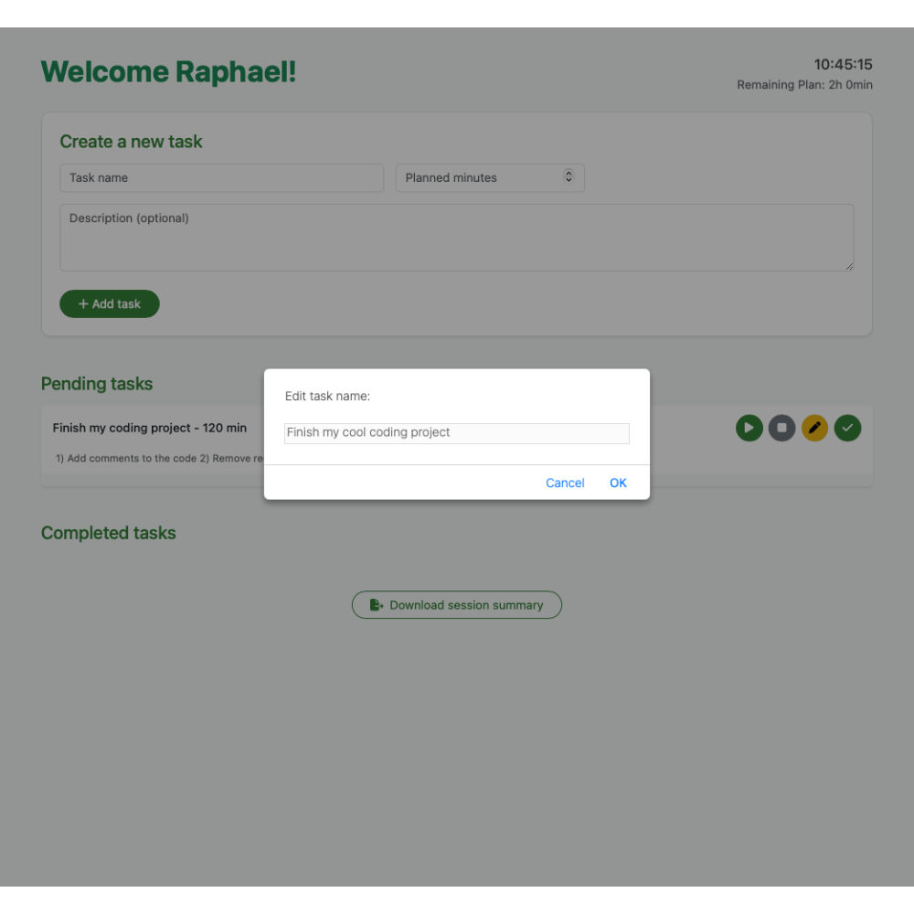
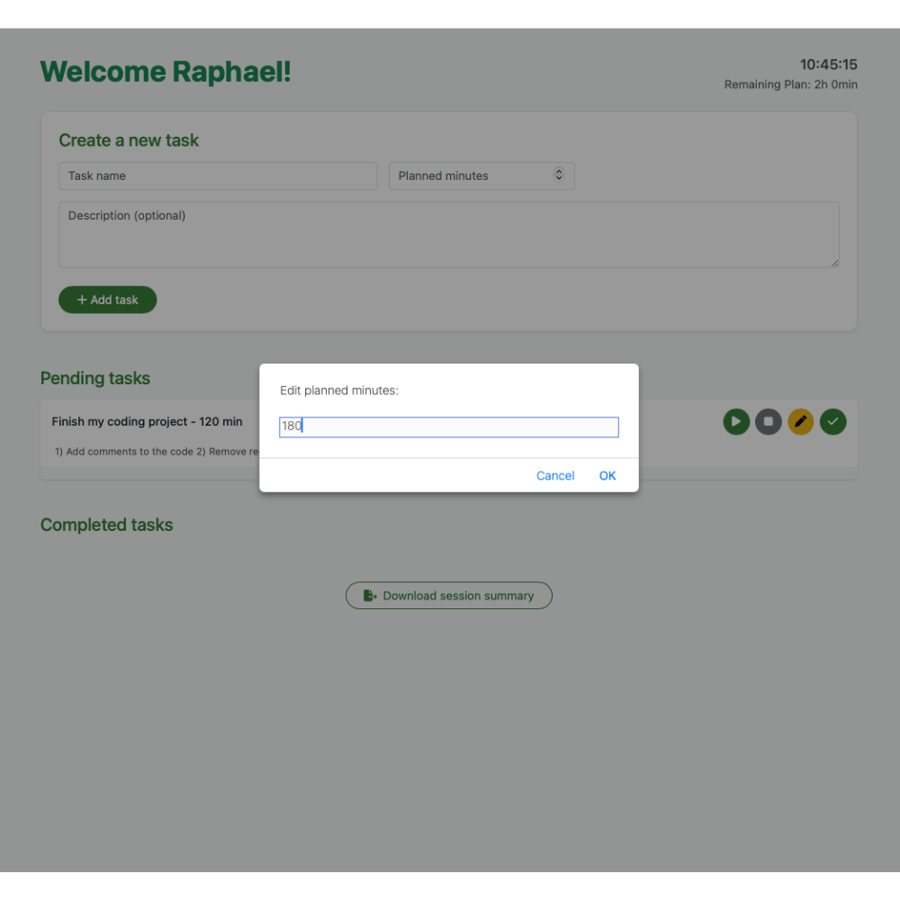
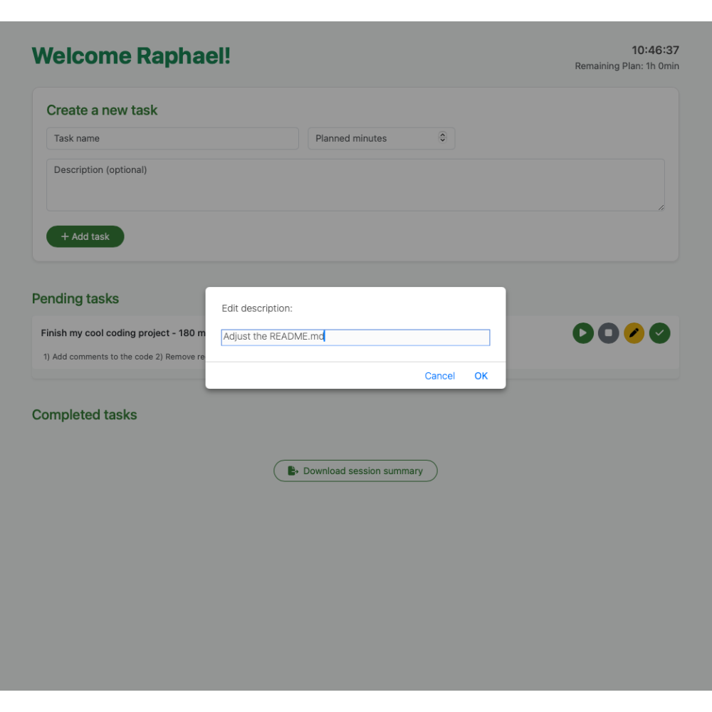

#  Study Task Manager

The **Study Task Manager** is a functional web application designed to help students structure and monitor their daily study sessions. It combines task planning, real-time tracking, and motivational support in one elegant and simple interface.

---

## Features

### Start a study session
- Input your **name** and **planned hours** (max 24h).
- The application checks if your planned time fits within today.
- Displays a personal welcome and study time countdown.

### Task management
- Add tasks with:
  - **Title**
  - **Planned minutes**
  - Optional **description**
- View tasks in a clean **Pending tasks** section.
- Start/stop a timer for each task.
- Mark tasks as Done when completed.
- View completed tasks in a **Completed tasks** section.

### Time & Tracking
- Live clock in the top corner.
- Remaining study time is updated in real time.

### Motivation & Quotes
- After completing a task, a random motivational **quote** is shown.

### Export
- **Download** your study session as an Excel file:
  - Includes all tasks, minutes and descriptions.
---

## Technologies used

- HTML, CSS, JavaScript
- [Bootstrap 5](https://getbootstrap.com/)
- [SheetJS](https://sheetjs.com/) (for Excel export/import)
- [PapaParse](https://www.papaparse.com/) (for CSV quotes)

---

## Usage

1. **Launch the App**  
   Open `index.html` in your preferred browser.

2. **Start Your Session**  
   Enter your name and planned study hours, then click **Start Session** to begin.

3. **Add Tasks**  
   Create tasks by entering a name, setting the estimated minutes, and (optionally) adding a short description.

4. **Manage Tasks**  
   Use the control buttons to **start**, **pause**, **edit**, or **complete** tasks as you progress.

5. **Wrap Up**  
   Once you're done, click **Download Session Summary** to export your study log as an Excel file.

---

## Preview

### Front page
On this screen, the user begins by entering their name and the number of hours they plan to study today. This step is required to unlock the task manager and ensures time tracking starts with clear intent.

### Start modal
Once the session starts, the user is able to add tasks using a simple form. Each task includes a name, a planned time in minutes, and an optional description. The system also shows a live clock and the remaining planned time in the corner.

### Pending tasks
Tasks appear in the To-Do list with action buttons. The user can start a timer, pause, edit, or mark the task as done. The timer counts down in real time, helping the user stay focused and on track with their planned duration.

### Edit tasks
After adding a task, users can edit any task at any time by clicking on the pencil icon next to it. As shown here, clicking the icon opens a dialog where you can change the task name directly. This allows you to refine or rename tasks as needed.

Next, the planned minutes can be adjusted. This is helpful if users over- or underestimated the time needed for a task.

Finally, users can refine the task description. For example, by adding substeps or clarifying notes to guide their focus while working.

### 💬 Motivational quote
After completing a task, it is moved to the Done Tasks list and the app shows a motivational quote. These quotes provide encouragement and help the user reset mentally before starting the next task. The quotes are randomly selected from a preloaded list.

---

## Optional extensions

- Add weekly stats dashboard
- Add feature to change "totalPlannedMinutes"
- Tag tasks (e.g. “Math”, “Reading”)
- Add dark mode

---

## About

Done by Raphael Philipp Bosshart as part of the lecture: *Skills: Programming with Advanced Computer Languages* in help of ChatGPT. 

---

## Sources

- Quotes used are based on the public dataset: [Quotes 500k – Kaggle](https://www.kaggle.com/datasets/manann/quotes-500k)  
- Favicon was created using: [Favicon.io Generator](https://favicon.io/favicon-generator/)

