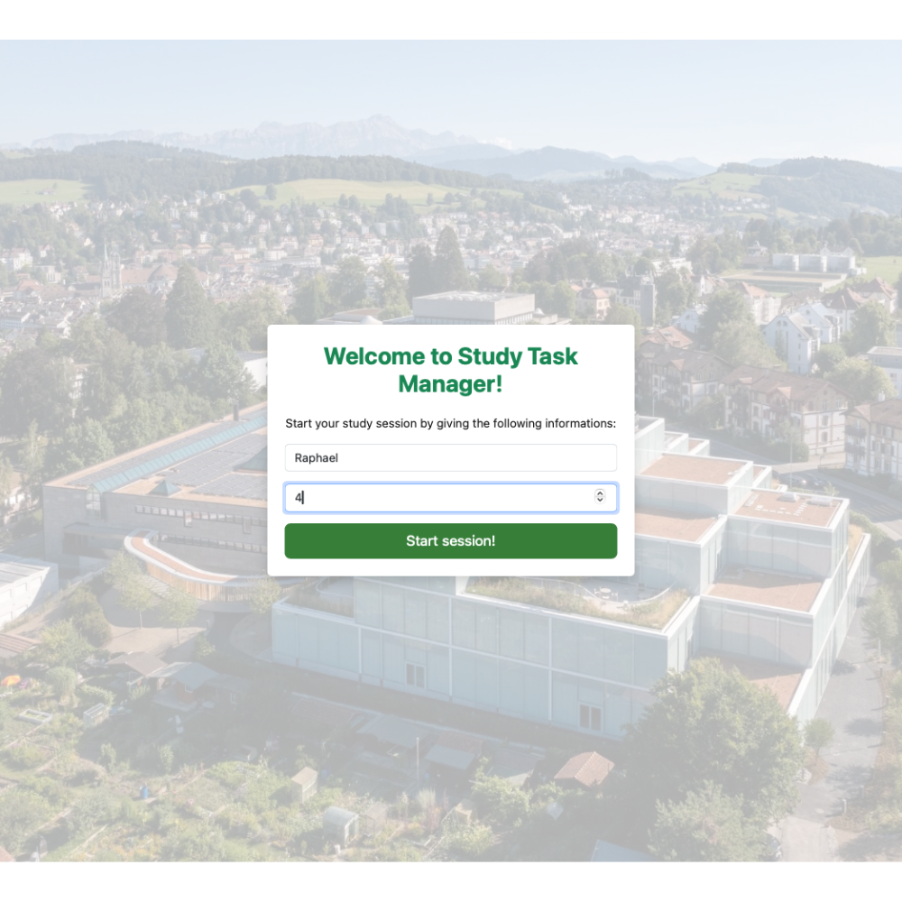
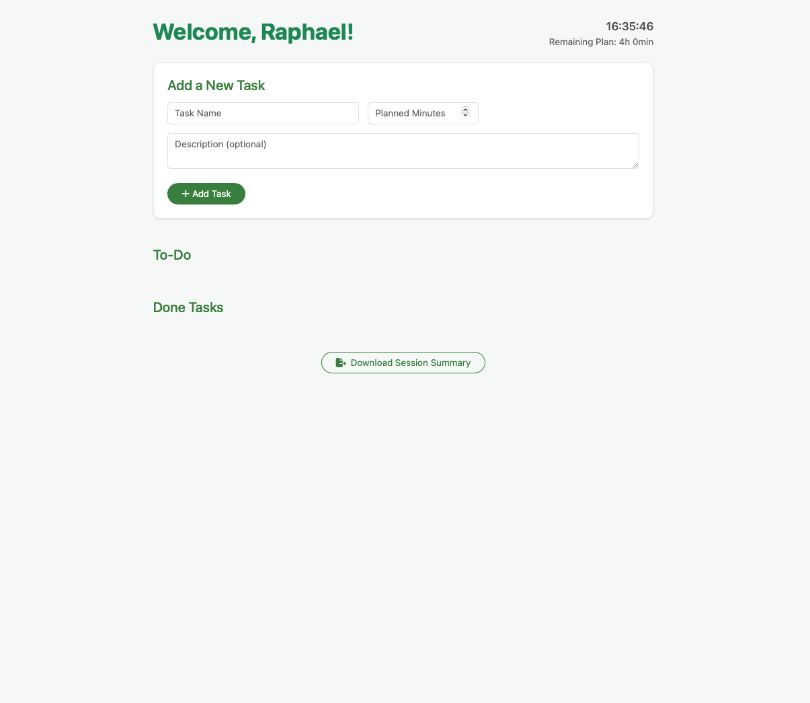
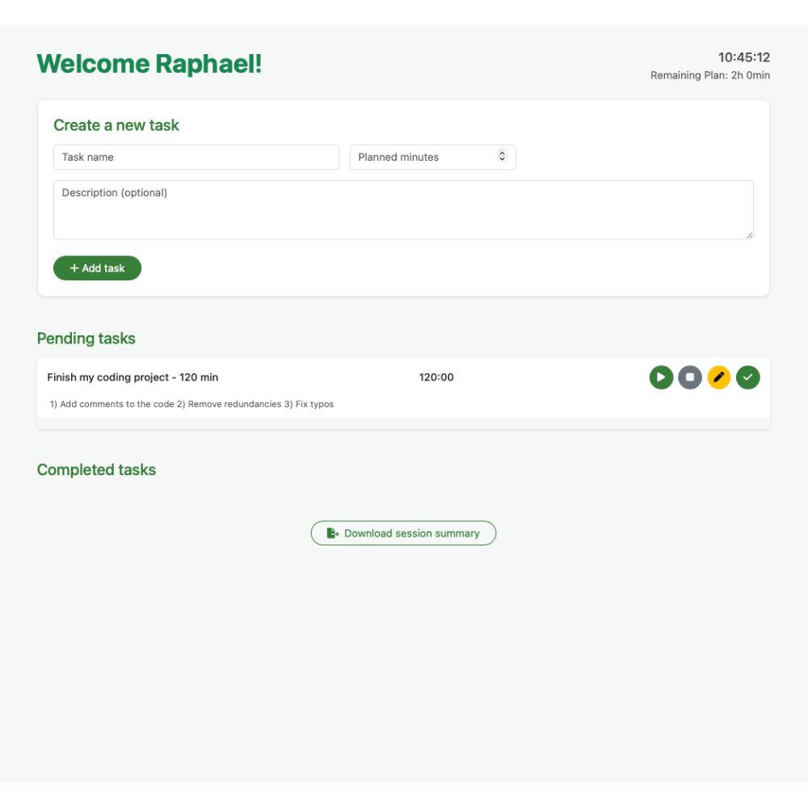
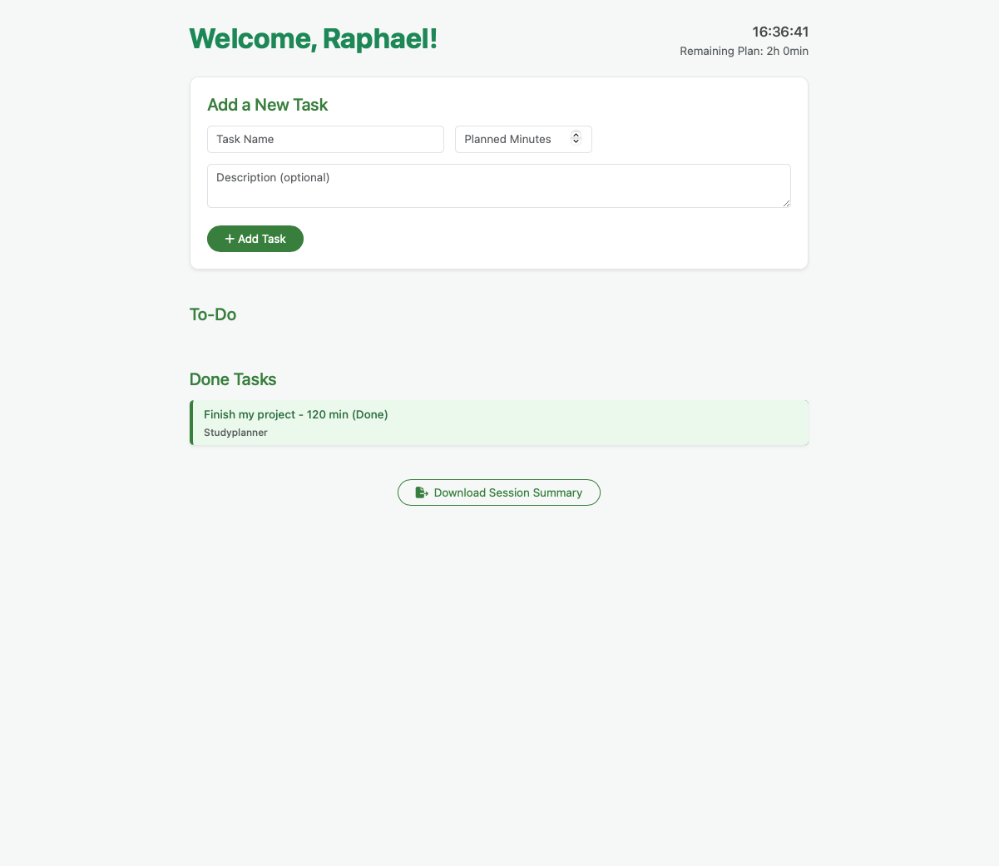
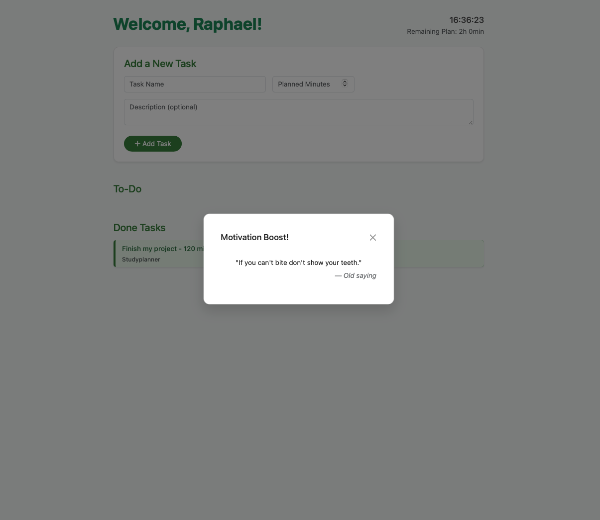

# Study Task Manager

The **Study Task Manager** is a lightweight yet functional web app designed to help students structure and monitor their daily study sessions. It combines task planning, real-time tracking, and motivational support in one elegant interface.

---

## Features

### Start a Study Session
- Input your **name** and **planned hours** (max 24h).
- The app checks if your planned time fits within today.
- Displays a personal welcome and study time countdown.

### Task Management
- Add tasks with:
  - **Title**
  - **Planned minutes**
  - Optional **description**
- View tasks in a clean **To-Do** section.
- Start/stop a **timer** for each task.
- Mark tasks as **Done** when completed.
- View completed tasks in a **Done** section.

### Time & Tracking
- Live **clock** in the top corner.
- Remaining study time is updated in real time.

### Motivation & Quotes
- After completing a task, a **random motivational quote** is shown.

### Export
- **Download** your study session as an Excel file:
  - Includes all tasks, minutes, descriptions, timestamps.
---

## Technologies Used

- HTML, CSS, JavaScript
- [Bootstrap 5](https://getbootstrap.com/)
- [SheetJS](https://sheetjs.com/) (for Excel export/import)
- [PapaParse](https://www.papaparse.com/) (for CSV quotes)

---

## Usage

1. Open `index.html` in a browser.
2. Enter your name and planned hours.
3. Add tasks and start working.
4. Stop and complete tasks.
5. Export your session.

---

## Preview

### Front Page

*View your active tasks, clock, and remaining study time in a clean layout.*

### Start Modal

*Start your session by entering your name and planned study hours.*

### To-Do Tasks

*Add new tasks with planned minutes and descriptions. Each task has timer and control buttons.*

### Task Completion

*Mark tasks as completed and see them moved into the Done section with styling.*

### 💬 Motivational Quote

*After completing a task, get inspired with a random motivational quote.*

---

## Optional Extensions

- Add **weekly stats dashboard**
- Add feature to change "totalPlannedMinutes"
- Tag tasks (e.g. “Math”, “Reading”)
- Add **dark mode**

---

## About

This project was created as part of the lecture: *Skills: Programming with Advanced Computer Languages* in help of ChatGPT. 

---

Done by Raphael Philipp Bosshart – for focus, clarity, and growth.

