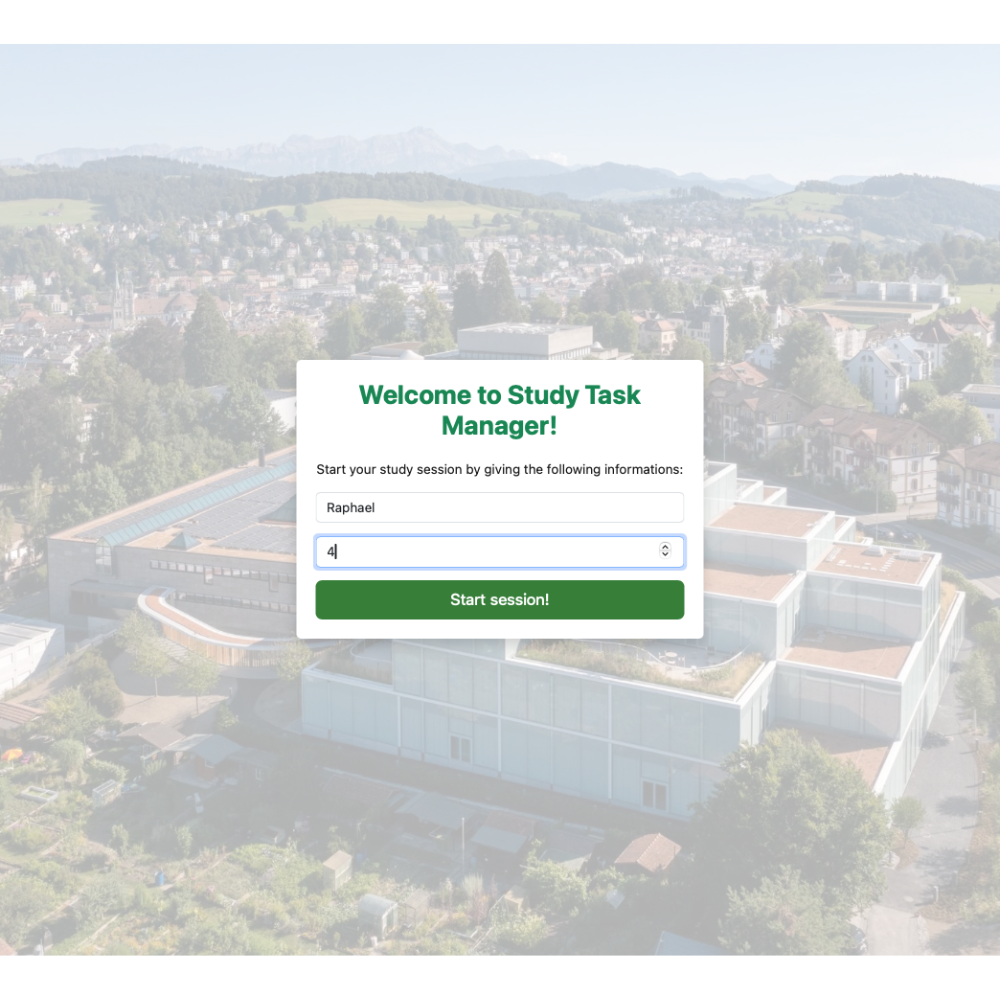
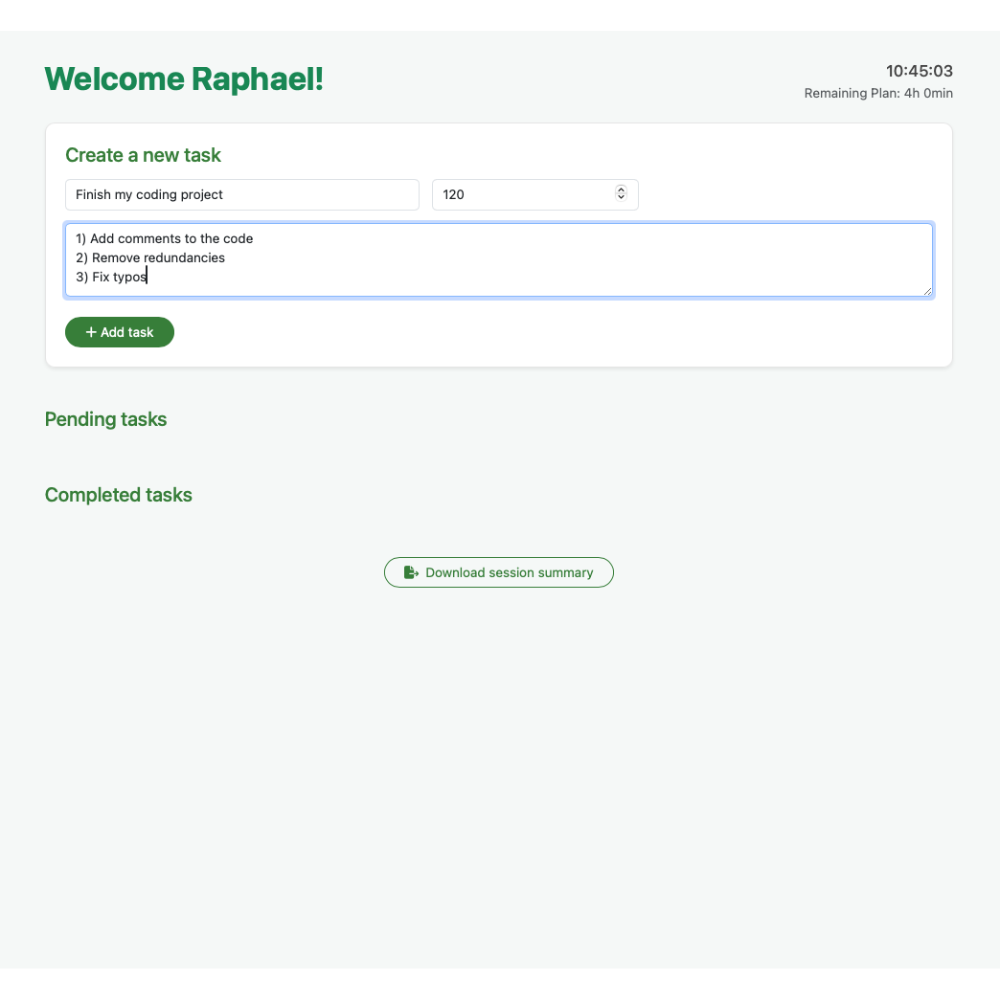
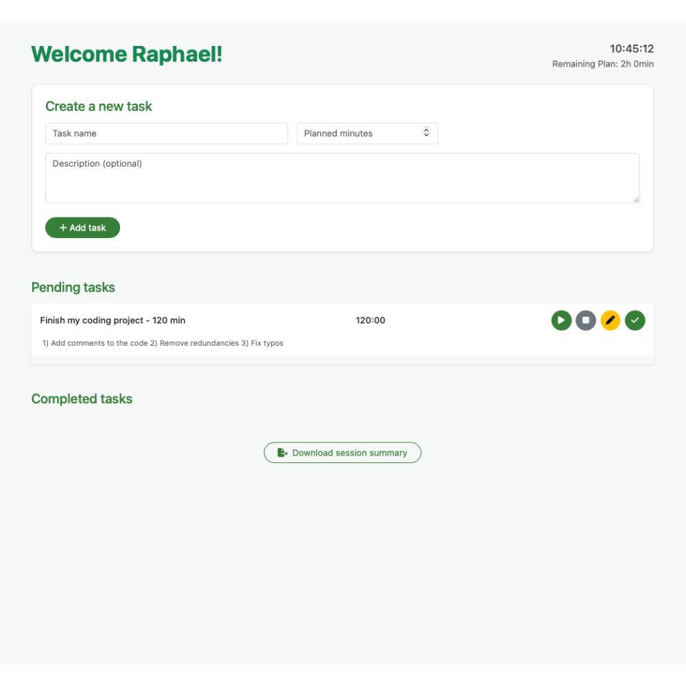
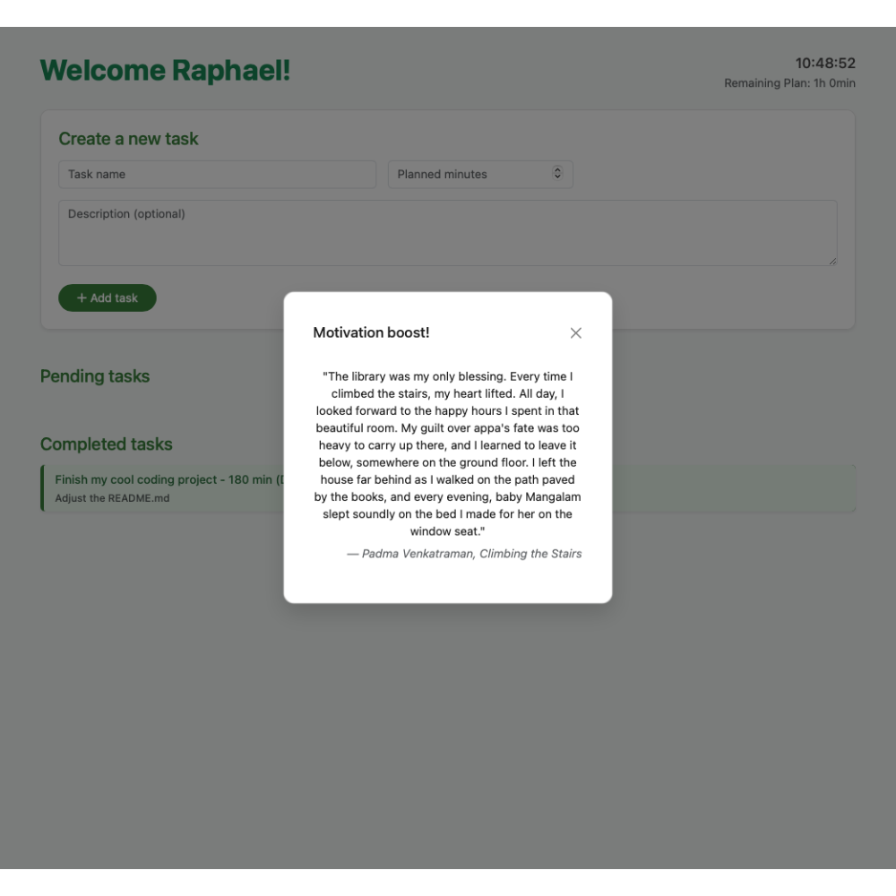

#  Study Task Manager

The **Study Task Manager** is a lightweight yet functional web app designed to help students structure and monitor their daily study sessions. It combines task planning, real-time tracking, and motivational support in one elegant interface.

---

## Features

### Start a study session
- Input your **name** and **planned hours** (max 24h).
- The app checks if your planned time fits within today.
- Displays a personal welcome and study time countdown.

### Task management
- Add tasks with:
  - **Title**
  - **Planned minutes**
  - Optional **description**
- View tasks in a clean **Pending tasks** section.
- Start/stop a **timer** for each task.
- Mark tasks as **Done** when completed.
- View completed tasks in a **Completed tasks** section.

### Time & Tracking
- Live **clock** in the top corner.
- Remaining study time is updated in real time.

### Motivation & Quotes
- After completing a task, a **random motivational quote** is shown.

### Export
- **Download** your study session as an Excel file:
  - Includes all tasks, minutes and descriptions.
---

## Technologies used

- HTML, CSS, JavaScript
- [Bootstrap 5](https://getbootstrap.com/)
- [SheetJS](https://sheetjs.com/) (for Excel export/import)
- [PapaParse](https://www.papaparse.com/) (for CSV quotes)

---

## Usage

1. Open `index.html` in a browser.
2. Enter your name and planned hours.
3. Add tasks and start working.
4. Stop and complete tasks.
5. Export your session.

---

## Preview

### Front page

On this screen, the user begins by entering their name and the number of hours they plan to study today. This step is required to unlock the task manager and ensures time tracking starts with clear intent.

### Start modal

Once the session starts, the user is able to add tasks using a simple form. Each task includes a name, a planned time in minutes, and an optional description. The system also shows a live clock and the remaining planned time in the corner.

### Pending tasks

Tasks appear in the To-Do list with action buttons. The user can start a timer, pause, edit, or mark the task as done. The timer counts down in real time, helping the user stay focused and on track with their planned duration.

### Completed tasks

When a task is marked as done, it is moved to the Done Tasks list. This area lets the user review what they have accomplished during the session. Each entry shows the task details and confirms its completion.

### 💬 Motivational quote

After completing a task, the app shows a motivational quote. These quotes provide encouragement and help the user reset mentally before starting the next task. The quotes are randomly selected from a preloaded list.

---

## Optional extensions

- Add **weekly stats dashboard**
- Add feature to change "totalPlannedMinutes"
- Tag tasks (e.g. “Math”, “Reading”)
- Add **dark mode**

---

## About

Done by Raphael Philipp Bosshart as part of the lecture: *Skills: Programming with Advanced Computer Languages* in help of ChatGPT. 

---

## Sources

- Quotes used are based on the public dataset: [Quotes 500k – Kaggle](https://www.kaggle.com/datasets/manann/quotes-500k)  
- Favicon was created using: [Favicon.io Generator](https://favicon.io/favicon-generator/)

